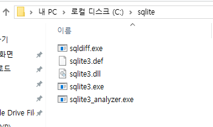
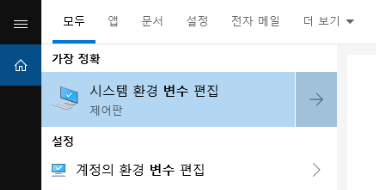
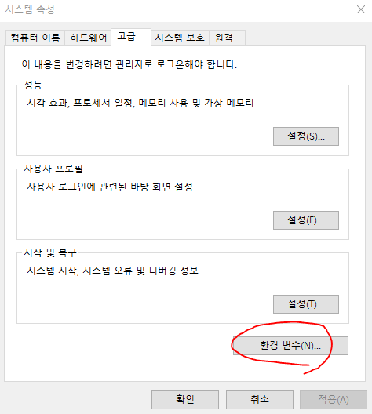
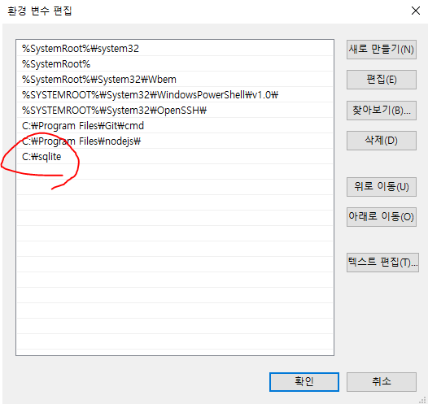
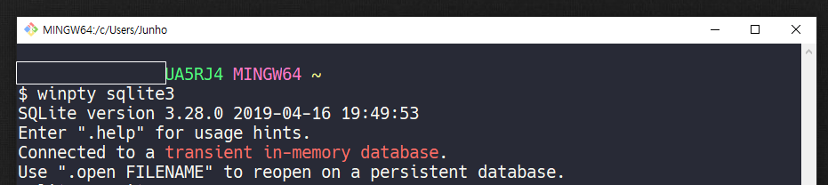
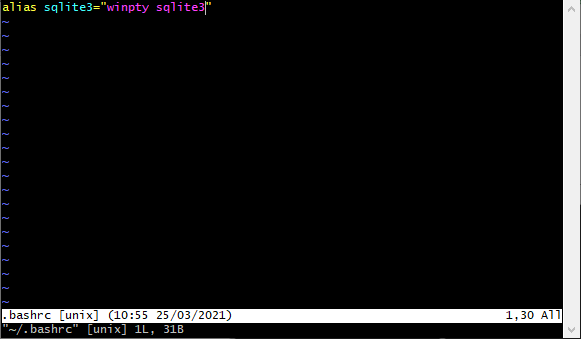
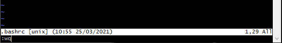
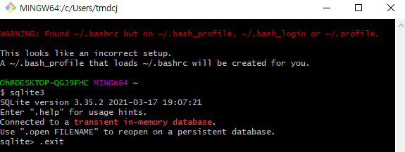

# sqlite3 설치 및 터미널 환경 설정

>  macOS는 기본적으로 내장되어 있음


## Windows 10 64bit

### 1. sqlite 공식 홈페이지

https://www.sqlite.org/download.html


### 2. zip 파일 2개 다운로드

> 파일명 마지막 8자리는 다를 수 있음


### 3. C드라이브 - `sqlite` 폴더생성 후 압축풀기




### 4. 시작 - 시스템 환경 변수 편집 - 환경 변수






### 5. 시스템 변수 path - 편집 - `C:￦sqlite` 등록 - 확인





### 6. 설치 확인

- 반드시 vscode, git bash 등 터미널 관련 프로그램 모두 종료 후 재시작

  ```bash
  $ winpty sqlite3
  ```

  
  
  

### 7. alias 등록

- vi 명령어 실행

  ```bash
  vi ~/.bashrc
  ```

- `i` 키(insert)를 눌러 삽입모드 전환

- alias (별칭) 등록

  ```bash
  alias sqlite3="winpty sqlite3"
  ```

  

  

- vi 편집기 종료를 위해 `esc` 키를 누르고 `:wq` 입력하여 저장 종료

  

  

- alias가 정상적으로 등록되었는지 확인

  ```bash
  sqlite3
  ```

  

  

- **WARNING 문구**가 나오면 `touch .bash_profile` 명령어 통해서 .bash_profile 파일 생성


