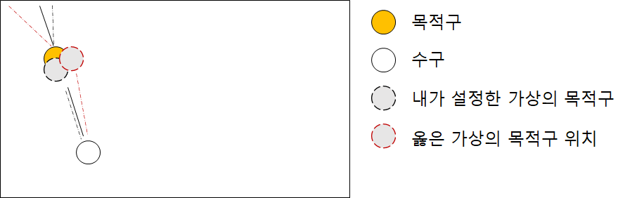

# 일타싸피 (Hit1Get4)

> 일종의 SSAFY 평가
>
> 시험 방식이 아닌, 게임 플레이 기법(**Gamification**)을 적용
>
> 당구 포켓볼을 간소화한 게임을 다양한 알고리즘으로 구현


## 진행 로직

### 1. 목적구 설정

- 내가 선인지 후인지를 판단

- 선이면 1, 3번 다음 8번

- 후면 2, 4번 다음 8번

  ```python
  # 로직 코드 본문
  	if gameData.order == 1:		# 선공이면 gameData.order가 1 그렇지 않으면 2
          target_num = [1, 3, 5]
      else:
          target_num = [2 ,4, 5]
  
      for i in target_num:
          if gameData.balls[i][0] != -1:
              targetBall_x = gameData.balls[i][0]
              targetBall_y = gameData.balls[i][1]
  ```

  

### 2. 목적구를 보낼 포켓 설정

- ~~수구-목적구-포켓을 꼭지점으로 한 삼각형을 가정할 때, 목적구 꼭지점의 각이 180도에 가까운 포켓을 설정~~
  - ~~180도라면 일직선이라는 의미이므로 넣기 더 쉬울 것이라 판단~~

  - ~~삼각형의 둔각을 구하는 방법~~
  - ~~수구/목적구의 각도 + (180 - 목적구/포켓 각도)~~
    - ~~두 지점간의 각도 구하는 것은 `atan2()`(역탄젠트) 함수 사용~~

- 삼각형의 둔각을 구하기에는 계산식의 경우의 수가 많아져 로직을 세우기 촉박함.

- 가까운 포켓에 위치한 공을 때리는 로직으로 변경하였음.

  - ~~검은공(8번 공)이 포켓 가까이에 위치하면 가차 없이 넣어버림~~
  - 해당 로직도 취소

- 포켓을 순회하며 **수구 x좌표 -> 목적구 x좌표 -> 포켓 x좌표 ** 순으로 나열될 때를 베스트 케이스로 조정

  - 추가적으로 **상단 포켓으로 칠지, 아래 포켓으로 칠지**를 설계
  - **수구 - 목적구 방향이 상단을 향한다면**, **상단 포켓만을 순회하게 구현**
  - 그 반대라면 하단 포켓만을 순회하도록 구현

  ```python
  # 로직 코드 본문
  # 목적구(target)가 수구보다 상단에 위치하면 1, 그렇지 않으면 -1
  
              if tar_direction == 1:
                  hole_num = [3, 4, 5]
              else:
                  hole_num = [0, 1, 2]
  
              for j in hole_num:
                  hole_x = HOLES[j][0]
                  hole_y = HOLES[j][1]
  				
                  # 중간 포켓이던, 끝 포켓이던 둘 중 하나는 걸리게 되어있음
                  if hole_x <= targetBall_x <= whiteBall_x or hole_x >= targetBall_x >= whiteBall_x:
                      ...
  ```

  

### 3. 각도 계산

#### A. 목적구와 수구간의 각도와 방향 계산

- 각도를 구할때는 `math.atan2(y, x)` 함수 사용

- `atan2()` 함수는 리턴값을 **음수 값**으로도 리턴해줌

  

  > ref : [두 점 사이의 절대각도를 재는 atan2](https://spiralmoon.tistory.com/entry/%ED%94%84%EB%A1%9C%EA%B7%B8%EB%9E%98%EB%B0%8D-%EC%9D%B4%EB%A1%A0-%EB%91%90-%EC%A0%90-%EC%82%AC%EC%9D%B4%EC%9D%98-%EC%A0%88%EB%8C%80%EA%B0%81%EB%8F%84%EB%A5%BC-%EC%9E%AC%EB%8A%94-atan2)


- 목적구와 수구의 각도와 방향를 재는 함수를 정의

  - `atan2()` 함수로부터 리턴되는 각도를 원하는 형태로 전처리 과정 필요

  ```python
  # 목적구와 수구의 각도와 방향을 측정하는 함수
  def get_targetDegree(x1, y1, x2, y2):
      # 수구 좌표 : x1, y1
      # 목적구 좌표 : x2, y2
      width = x2 - x1
      height = y2 - y1
  
      radian = math.atan2(height, width)
  	
      # 목적구가 수구의 좌상단에 위치
      if x1 >= x2 and y1 < y2:
          degree = 180 - (180 / math.pi * radian)
          direction = 1
      
      # 목적구가 수구의 우상단에 위치
      elif x1 < x2 and y1 < y2:
          degree = 180 / math.pi * radian
          direction = 1
  	
      # 목적구가 수구의 우하단에 위치
      elif x1 < x2 and y1 >= y2:
          degree = 90 - abs(180 / math.pi * radian)
          direction = -1
  	
      # 목적구가 수구의 좌하단에 위치
      elif x1 >= x2 and y1 >= y2:
          degree = abs(180 / math.pi * radian) - 90
          direction = -1
  	
      # 목적구와 수구의 전처리 각도, 수구가 목적구를 치는 방향 리턴
      return degree, direction
  ...
  	...
  	tar_degree, tar_direction = get_targetDegree(whiteBall_x, whiteBall_y, targetBall_x, targetBall_y)
      ...
  ```


#### B. 포켓과 목적구간의 각도~~와 거리~~ 계산

- **수구가 목적구를 어떤 각도로 쳐야할지를 계산하기 위해** 목적구가 포켓을 바라보고 있는 각도를 계산하는 함수 정의

- ~~전에 설계했던 로직인 거리 계산은 필요가 없어짐 ㅠ~~

- 사실상 `get_targetDegree()` 함수와 같은 기능

  ```python
  # 포켓과 목적구의 각도를 계산하는 함수
  def get_holeDegree(x1, y1, x2, y2):
      # 목적구 좌표 : x1, y1
      # 포켓 좌표 : x2, y2
      width = x2 - x1
      height = y2 - y1
  
      radian = math.atan2(height, width)
      distance = math.sqrt(width**2 + height**2)
  
      if x1 >= x2 and y1 < y2:
          degree = 180 - (180 / math.pi * radian)
      
      elif x1 < x2 and y1 < y2:
          degree = 180 / math.pi * radian
  
      elif x1 < x2 and y1 >= y2:
          degree = 90 - abs(180 / math.pi * radian)
  
      elif x1 >= x2 and y1 >= y2:
          degree = abs(180 / math.pi * radian) - 90
  
      return degree, distance
  ```

  ```python
  # 로직 코드 본문
      		...
      		for j in hole_num:
                  hole_x = HOLES[j][0]
                  hole_y = HOLES[j][1]
  
                  if hole_x <= targetBall_x <= whiteBall_x or hole_x >= targetBall_x >= whiteBall_x:
                      hole_degree, _ = get_holeDegree(targetBall_x, targetBall_y, hole_x, hole_y)
                      ...
  ```


#### C. 분리각 계산

- 수구가 목적구를 칠때 각도에 따라 목적구의 진행방향이 달라진다.

- 이를 **분리각**이라고 부름

  

  > beta = 분리각

- 포켓볼이므로 수구의 진행방향은 크게 신경쓰지 않기로..

- 분리각이 어떤식으로 나올지 열심히 그려서 유추해본 결과

  - 만약 **`tar_degree > hole_degree` 일 경우**, **분리각은 `tar_degree - hole_degree`**
  - 그렇지 않고  **`hole_degree > tar_degree` 일 경우**, **분리각은 `hole_degree > tar_degree`** 

  ```python
  # 로직 코드 본문
  # 어떤 포켓으로 갈지 정해진다면, 해당 포켓과 목적구 간의 각도를 계산
  # 전에 계산했던 목적구와 수구의 각도값을 통해 분리각을 계산
  
  ...
                  if hole_x <= targetBall_x <= whiteBall_x or hole_x >= targetBall_x >= whiteBall_x:
                      hole_degree, _ = get_holeDegree(targetBall_x, targetBall_y, hole_x, hole_y)
                      if tar_degree > hole_degree:
                          sep_point = tar_degree - hole_degree
                      else:
                          sep_point = hole_degree - tar_degree
  ```

  - `sep_point` 만큼 각도를 틀어야 내가 원하는 포켓으로 향할 듯


### 4. 실제 수구를 칠 각도 계산

#### A. 분리각을 계산해서 목적구 위치 조정

- 위에서 계산한 **목적구와 수구 사이의 각도**대로 쳐버리면 정빵만 맞음

- 그럼 아무 의미 없으니까 **정확하지 않더라도 비스므리하게라도 비껴 맞게끔 재설정 필요**

  - 분리각이 클수록 목적구를 얇게 따야하고, 분리각이 작을수록 목적구를 두껍게 따야함

  ```python
  # 로직 코드 본문
  	# beta 값 = 분리각
  	beta = [0, 70, 55, 50, 45, 35, 30, 25, 20, 15, 10, 5, 0]            
      
      			if hole_x <= targetBall_x <= whiteBall_x or hole_x >= targetBall_x >= whiteBall_x:
                      hole_degree, _ = get_holeDegree(targetBall_x, targetBall_y, hole_x, hole_y)
                      if tar_degree > hole_degree:
                          sep_point = tar_degree - hole_degree
                      else:
                          sep_point = hole_degree - tar_degree
                      
                      # 위에서 코드로 분리각을 찾아냈다고 가정
                      # 그럼 어느정도 두께로 비껴쳐야할지를 계산해야함
                      
                      # 수정할 포인트 값 초기화
                      new_point = 0
                      for k in range(1, len(beta)):	# 임의로 설정해놓은 분리각을 순회
                          # beta[k] 값에 +- 2.5도에 분리각이 포함된다면
                          if beta[k]-2.5 <= sep_point < beta[k]+2.5:
                              # k/12 만큼 비껴치기
                              new_point = 5.72 - (5.72 * k/12)
                      
                      # 문제(반례)가 많은 부분 (하단에 기술)
                      # 수구를 위로 칠때 (목적구도 상단 포켓으로 향할 것)
                      # 기존 목적구보다 k/12 만큼 하단의 가상 목적구를 지정해 각도와 파워 리턴
                      if tar_direction == 1:
                          angle, power = getAngle(whiteBall_x, whiteBall_y, targetBall_x, targetBall_y - new_point)
                      
                      # 수구를 아래로 칠때 (목적구도 하단 포켓으로 향할 것)
                      # 기존 목적구보다 k/12 만큼 상단의 가상 목적구를 지정, 각도와 파워 리턴
                      elif tar_direction == -1:
                          angle, power = getAngle(whiteBall_x, whiteBall_y, targetBall_x, targetBall_y + new_point)
  ```

  ```python
  # 가상의 목적구를 향해 치는 각도와 파워 계산 함수
  
  def getAngle(x1, y1, x2, y2):
      # x1, y1 수구 좌표
      # x2, y2 가상의 목적구 좌표
      width = x2 - x1
      height = y2 - y1
  
      radian = math.atan2(height, width)
  
      if x1 >= x2 and y1 < y2:
          angle = 270 + (180 - 180 / math.pi * radian)
      
      elif x1 < x2 and y1 < y2:
          angle = 90 - 180 / math.pi * radian
  
      elif x1 < x2 and y1 >= y2:
          angle = 90 + abs(180 / math.pi * radian)
  
      elif x1 >= x2 and y1 >= y2:
          angle = 90 + abs(180 / math.pi * radian)
  
      distance = math.sqrt(width**2 + height**2)
      power = distance
  
      return angle, power
  ```

  

### 5. 기타 고려 사항

#### A. 세기 계산

- 테스트로 약하게도 쳐보고 강하게도 쳐봤는데, 정밀한 로직이 아니므로 걍 씨게 치는게 장땡

#### B. 현재 로직의 반례

- 내 입맛의 당구공 배치

  - 목적구가 상단 포켓으로 향할 때 (하단도 같은 맥락)

  

- 반례

  - 같은 의미로 목적구가 상단 포켓으로 향함

  - 하지만 나는 분리각에 대한 가상의 목적구 위치를 y축만을 고려했음

    


- 시간이 없어서 그냥 y축만 고려한 가상 목적구 위치를 때렸는데,  운빨이 터져서 여차저차 이기게 됨
- 진짜 야무지게 로직을 세운다고하면 다음의 경우를 추가적으로 생각해야 함
  - **그 속에서 `tar_degree > hole_degree` 일 경우와 `tar_degree > hole_degree` 일 경우를 고려**
    - 단순히 분리각 계산을 위한 것이 아닌 **당구공 배치의 모양을 고려하기 위함**
    - `tar_degree`가 더 크다면 **아래에서 위로 치는 모양새 즉, 횡단하는 모양이 나올 것이고**, (반례와 같은 배치)
    - `hole_degree`가 더 크다면 **옆으로 길게 치는 모양새 즉, 종단하는 모양이 나올 것이다.**
  - 각도의 크기 차이와 더불어 **수구가 목적구를 왼쪽에서 오른쪽으로 때리는지, 오른쪽에서 왼쪽으로 때리는지**를 고려해야 함
    - 
  - 그 속에서 `tar_degree > hole_degree` 일 경우와 `tar_degree > hole_degree` 일 경우를 고려
    - 그래야 `new_point` 값을 **x축으로 수정할 지, y축으로 수정할 지**를 결정할 수 있음
- 결론적으로 **(1. 수구가 위 아래로 가느냐)에 추가적으로 2. 왼쪽으로 보내냐 오른쪽으로 보내냐, 3. 포켓각 혹은 목적구 각 누가 더 큰지**를 모두 한꺼번에 고려해야함 (2X2X2 총 8가지 경우, 현재는 **1.** 만 구분만 했음)