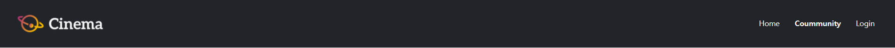
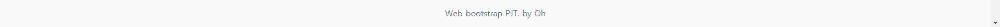
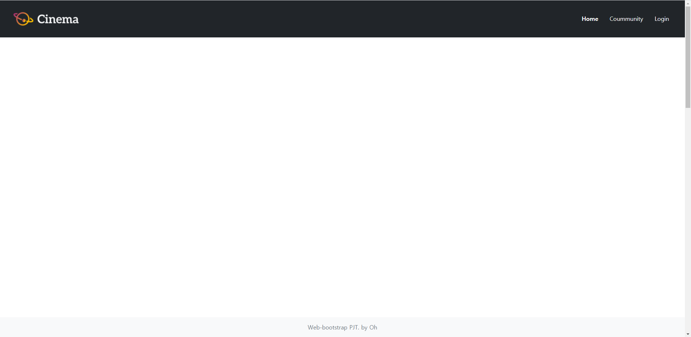
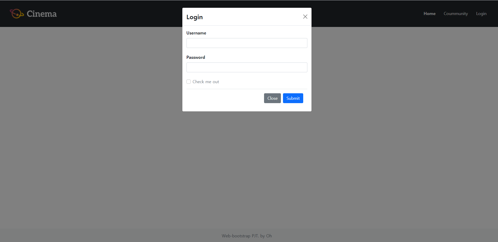
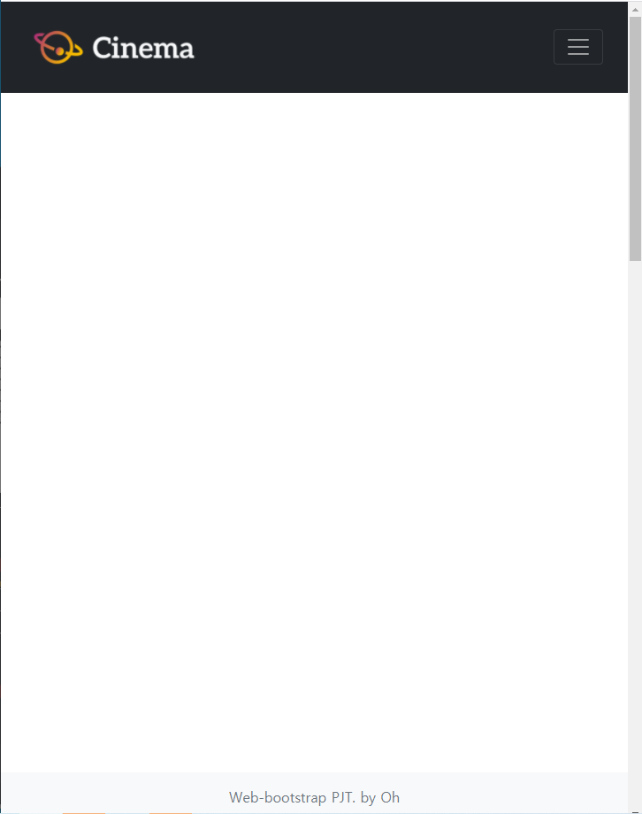
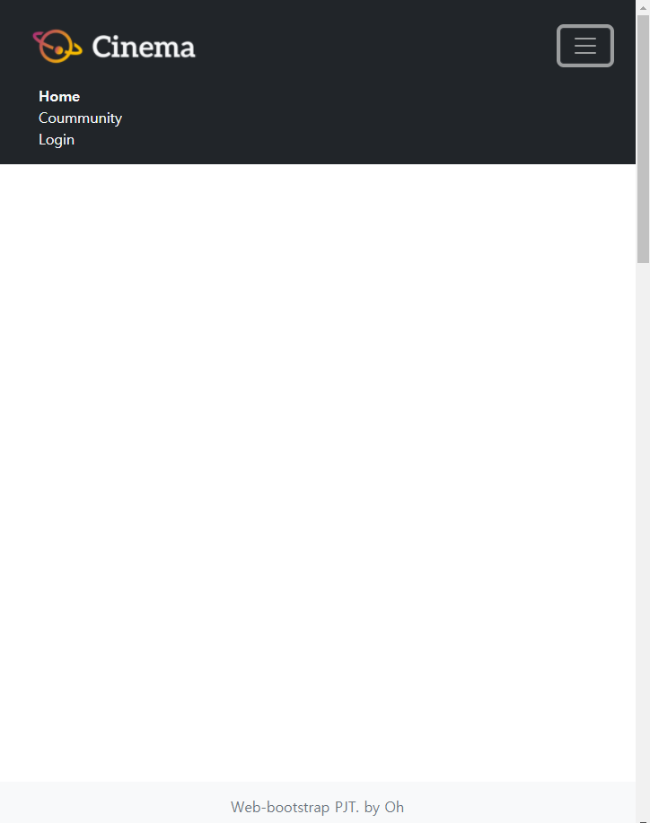
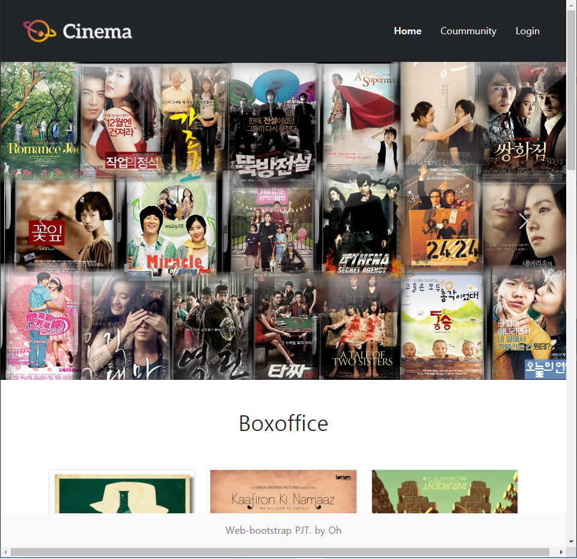
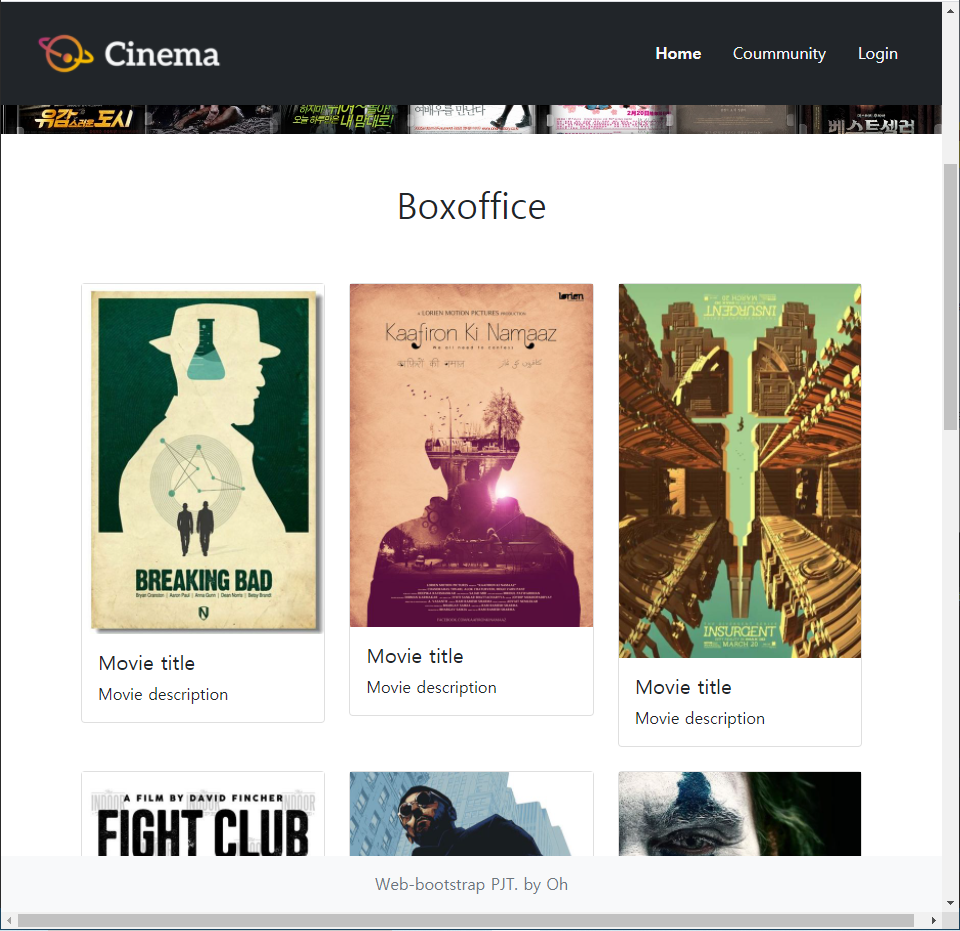
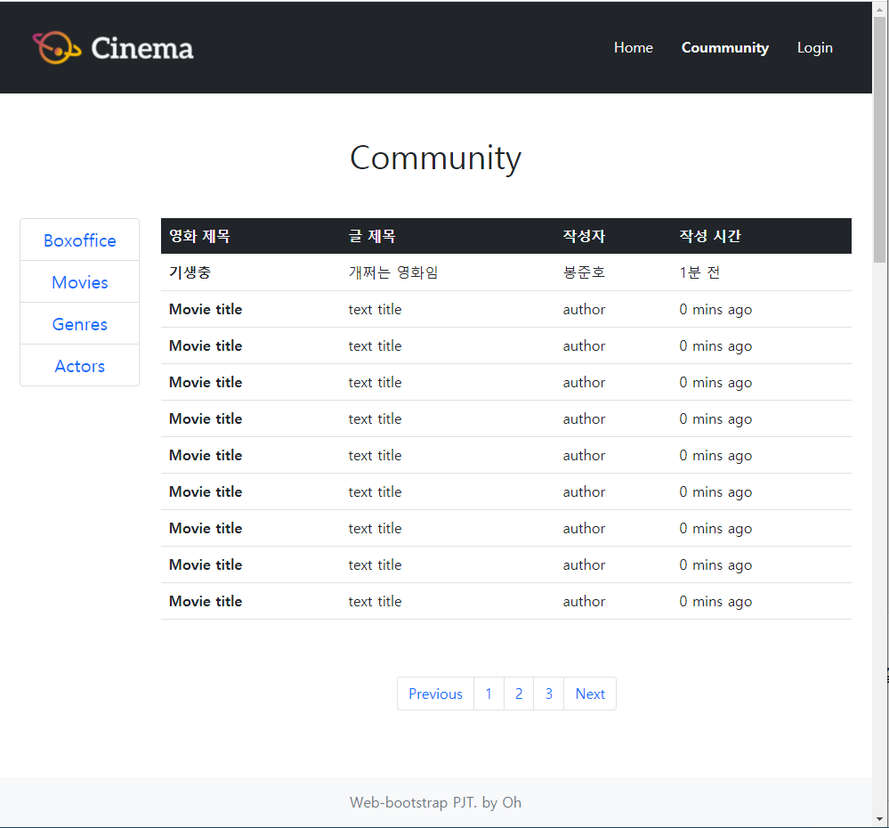
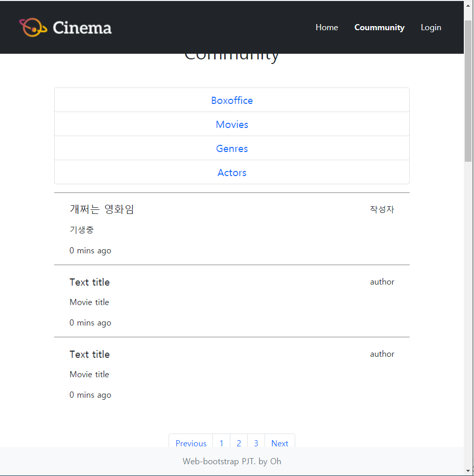

# PJT 03

> 반응형 웹 페이지 구성


## 00. 프로젝트 소개

### 1. 목표

- HTML을 통한 웹 페이지 마크업 분석
- CSS 라이브러리의 이해와 활용
- 컴포넌트 및 그리스 시스템 활용
- 커뮤니티 서비스 반응형 레이아웃 구성


### 2. 준비사항

- 개발도구

  - `Visual Studio Code`
  - `Google Chrome Browser`
  - `Bootstrap v5.0`

- 제공 Assets

  - | 경로/파일명        |                        설 명                        |
    | ------------------ | :-------------------------------------------------: |
    | images/            |          사용할 이미지들이 들어 있습니다.           |
    | 01_nav_footer.html | 모든 페이지가 공유할 Navigation bar 및 Footer입니다 |
    | 01_nav_footer.css  |    Navigation bar 및 Footer의 커스텀 CSS입니다.     |
    | 02_home.html       |     사용자가 처음 접속하면 보게 될 페이지입니다     |
    | 02_home.css        |           home.html 의 커스텀 CSS입니다.            |
    | 03_community.html  |       사용자들끼리 의견을 나누는 게시판입니다       |
    | 03_community.css   |    community.html 의 스타일의 커스텀 CSS입니다.     |


### 3. 요구사항

커뮤니티 서비스 개발을 위한 화면 구성 단계로, 유저가 보는 프론트엔드를 개발합니다.

아래 기술된 사항은 필수적으로 구현해야 하는 내용입니다.

- A. 01_nav_footer
- B. 02_home
- C. 03_community


## 01. 프로젝트 내용

### A. 01_nav_footer

첫번째 과제는 모든 홈페이지에 공통으로 들어갈 `nav` 와 `footer` 부분이다.

> - `nav`
>
> 
>
> - `footer`
>
> 


#### 네이게이션 바 (Navigation Bar)

1. 네비게이션 바는 스크롤을 하더라도 **항상 상단에 고정**되어 있습니다. 
2. 로고 이미지는 images 폴더 안의 `logo.png`파일을 사용합니다. 
3. **로고 이미지는 클릭이 가능한 링크**이며, 해당 페이지(`02_home.html`)로 이동해야 합니다. 
4. 네비게이션 바 내부의 네비게이션 리스트(Home, Community, Login)는 **`ul` 과 `li` 요소를 사용**합니다. 
5. 네비게이션 바 내부의 네비게이션 리스트(Home, Community, Login)는 **오른쪽에 배치**합니다. 
6. 네비게이션 리스트의 각 항목들은 **클릭이 가능한 링크**이며, 해당 페이지 (`02_home.html, 3_community.html, #`)로 이동해야 합니다. 
7. 네비게이션 리스트(Home, Community, Login)의 항목들 중에서 **`Home`**을 강조합 니다. 
8. 네비게이션 리스트의 **Login 항목**은 클릭 시 요소가 **`Modal 컴포넌트`** 를 통하여 나타납니다. (페이지 이동이 일어나지 않습니다.) 
9. `Modal 컴포넌트` 내부에는 **`form` 요소를 배치**합니다. 
10. `Modal 컴포넌트` 에서 `form` 요소 내부의 **비밀번호는 표시되지 않습니다.** 
11. `Viewport`의 가로 크기가 **768px 미만**일 경우에는 네비게이션 리스트(Home, Community, Login)가 **햄버거 버튼으로 교체**되며, 클릭했을 시 세부 항목을 볼 수 있습니다.

```html
  <!-- 01_nav_footer.html -->
  <nav class="navbar navbar-expand-md navbar-dark bg-dark sticky-top px-3">
    <div class="container-fluid">
      <a class="navbar-brand text-decoration-none" href="02_home.html">
        
      </a>
      <button class="navbar-toggler" type="button" data-bs-toggle="collapse" data-bs-target="#navbarTogglerDemo02" aria-controls="navbarTogglerDemo02" aria-expanded="false" aria-label="Toggle navigation">
        <span class="navbar-toggler-icon"></span>
      </button>

      <div class="collapse navbar-collapse" id="navbarTogglerDemo02">
        <ul class="navbar-nav ms-auto mb-2 mb-md-0">
          <li class="nav-item">
            <a class="text-decoration-none link-light px-3 fw-bold" href="02_home.html">Home</a>
          </li>
          <li class="nav-item">
            <a class="text-decoration-none link-light px-3" href="03_community.html">Coummunity</a>
          </li>
          <li class="nav-item">
            <a class="text-decoration-none link-light px-3" data-bs-toggle="modal" data-bs-target="#exampleModal" href="#">Login</a>
          </li>
        </ul>
      </div>
    </div>
  </nav>

  <div class="modal fade" id="exampleModal" tabindex="-1" aria-labelledby="exampleModalLabel" aria-hidden="true">
    <div class="modal-dialog">
      <div class="modal-content">
        <div class="modal-header">
          <h4 class="modal-title fw-bold" id="exampleModalLabel">Login</h4>
          <button type="button" class="btn-close" data-bs-dismiss="modal" aria-label="Close"></button>
        </div>
        <div class="modal-body">
          <form>
            <div class="mb-4">
              <label for="exampleInputEmail1" class="form-label fw-bold">Username</label>
              <input type="email" class="form-control" id="exampleInputEmail1" aria-describedby="emailHelp">
            </div>
            <div class="mb-4">
              <label for="exampleInputPassword1" class="form-label fw-bold">Password</label>
              <input type="password" class="form-control" id="exampleInputPassword1">
            </div>
            <div class="mb-3 form-check">
              <input type="checkbox" class="form-check-input" id="exampleCheck1">
              <label class="form-check-label text-secondary" for="exampleCheck1">Check me out</label>
            </div>
            <div class="modal-footer">
              <button type="button" class="btn btn-secondary" data-bs-dismiss="modal">Close</button>
              <button type="button" class="btn btn-primary">Submit</button>
            </div>
          </form>
        </div>
      </div>
    </div>
  </div>
```


#### 푸터 (Footer)

1. 푸터는 스크롤을 하더라도 항상 **하단에 고정**되어 있습니다.
2. 푸터에 작성된 내용은 **수평으로 정렬**되어 있습니다. (왼쪽, 오른쪽 여백이 같습니다.)
3. 푸터에 작성된 내용의 빈 부분(`_____`)은 본인의 이름을 작성합니다.
4. 위에 명시된 내용 이외에는 자유롭게 작성합니다

```html
<footer class="fixed-bottom py-3 bg-light">
    <div class="text-center text-secondary">Web-bootstrap PJT. by Oh</div>
  </footer>
```


#### 결과

- 전체화면



- 로그인 화면



- `Viewport`의 가로 크기가 **768px 미만**인 경우




#### :bulb: Point

- 구현은 완료했으나, 정말 많은 시간이 소요됐다.
- 주로 참고한 Docs는 [Modal 컴포넌트](https://getbootstrap.com/docs/5.0/components/modal/)와 [Navbar 컴포넌트](https://getbootstrap.com/docs/5.0/components/navbar/)이다.
- `Modal`을 추가하기 까지는 순탄하게 흘러갔다. 하지만 반응형 `Nav` 를 구성하는데 오래걸렸다.

- 사실 지금 다시 복기해보면 오래 걸릴 이유가 없지만, 하나하나 Docs를 참고하며 내 입맛에 맞게 적용하던 것이 오래 걸렸던 이유인 것 같다.
- 웹 프론트는 정말 인내의 끝판왕이다...


### B. 02_home

`01_nav_footer`에서 완성한 것을 복사하여 이어 진행한다.

#### 네비게이션 바 (Navigation Bar)

1. 네비게이션 리스트(Home, Community, Login)의 항목들 중에서 **Home을 강조**합니다.
2. Home 페이지는 크게 상단 `Header`와 하단 `Section`요소로 이루어져 있습니다.

#### Header

1. `Header`는 이미지는 최소 3장이며, 자동으로 전환됩니다. 이미지는 자유롭게 선택합니다.

   (images/폴더 안의 header 이미지들을 사용해도 됩니다.)

```html
  <header>
    <div id="carouselExampleControls" class="carousel slide" data-bs-ride="carousel">
      <div class="carousel-inner">
        <div class="carousel-item active">
          
        </div>
        <div class="carousel-item">
          
        </div>
        <div class="carousel-item">
          
        </div>
      </div>
      <a class="carousel-control-prev" href="#carouselExampleControls" role="button" data-bs-slide="prev">
        <span class="carousel-control-prev-icon" aria-hidden="true"></span>
        <span class="visually-hidden">Previous</span>
      </a>
      <a class="carousel-control-next" href="#carouselExampleControls" role="button" data-bs-slide="next">
        <span class="carousel-control-next-icon" aria-hidden="true"></span>
        <span class="visually-hidden">Next</span>
      </a>
    </div>
  </header>
```

#### Section

1. `Section` 내부의 개**별 요소(article)들은 이미지, 제목, 설명을 포함**하며 각 요소(article)들은 **좌우 일정한 간격**으로 떨어져 있습니다.

   (간격은 자유롭게 설정 가능하며 `images/폴더` 안의 movie 이미지들을 사용해도 됩니다.) 

2. `Section` 내부의 요소(article)들은 Viewport의 가로 크기가 **576px미만일 경우에는 한 열(row)에 1개씩 표시**됩니다. 

3. `Section` 내부의 요소(article)들은 Viewport의 가로 크기가 **576px이상일 경우에는 한 열(row)에 2개 이상 자유롭게 표시**합니다.

4. 위에 명시된 내용 이외에는 자유롭게 작성합니다.


#### 결과




#### :bulb: Point

- `Header` 의 구성은 `Bootstrap` 의 `Carouse` 컴포넌트를 활용하였다. 이미지 경로만 지정해주고, 오늘 중 제일 쉬운 작업이라고 생각한다.
- `Section` 의 요소들은 `Card` 컴포넌트로 구성하였다. 이미지와 글의 제목, 글 내용으로 구성된 카드를 사용했다.
- 또한`Section` 구역에 `Responsive Grid Layout` 을 활용하였다. 기존에 명세에는 열에 1개-2개 표시하라고 되어있던 것에 추가하여 1개-2개-3개-6개로 구성하였다. 
- 본 과제는 상당히 빠르게 끝났다 :smiley:


### C. 03_commuity

`01_nav_footer`에서 완성한 것을 복사하여 이어 진행한다.


#### 네비게이션 바 (Navigation Bar)

1. 네비게이션 리스트(Home, Community, Login)의 항목들 중에서 **Community를 강조**합니다. 
2. Community 페이지는 크게 **게시판 목록, 게시판**으로 이루어져 있습니다. 
3. 게시판 목록과 게시판은 `div.main` 요소로 둘러쌓여 있습니다.


#### 게시판 목록

1. 게시판 목록은 `aside` 요소로 이루어져 있습니다. 
2. 게시판 목록 내부의 각 항목들(Boxoffice, Movies, Genres, Actors)은 `ul`과 `li` 요소를 사용합니다. 
3. 게시판 목록 내부의 각 항목들은 클릭이 가능한 링크이며, 모두 동작은 하지 않습니다. 
4. Viewport의 가로 크기가 **992px 이상일 경우**에는 게시판 목록 내부의 항 목들(Boxoffice, Movies, Genres, Actors)은 `div.main` 영역의 **내부에서 좌측 1/6 만큼의 너비**를 가집니다. 
5. Viewport의 가로 크기가 **992px 미만일 경우**에는 게시판 목록 내부의 항 목들(Boxoffice, Movies, Genres, Actors)은 `div.main` 영역의 내부에서 **전체만 큼의 너비**를 가집니다.

```html
  <div class="main container">
    <h1 class="text-center my-5">Community</h1>
      <div class="row">
      <!-- Sidebar -->
        <aside class="col-lg-2">
          <ul class="list-group text-center fs-5 mb-3">
            <li class="list-group-item">
              <a class="text-decoration-none" href="#">Boxoffice</a>
            </li>
            <li class="list-group-item">
              <a class="text-decoration-none" href="#">Movies</a>
            </li>
            <li class="list-group-item">
              <a class="text-decoration-none" href="#">Genres</a>
            </li>
            <li class="list-group-item">
              <a class="text-decoration-none" href="#">Actors</a>
            </li>
          </ul>
        </aside>
```


#### 게시판

1. 게시판은 **Viewport의 가로크기에 따라 전혀 다른 요소를 표시**합니다.
2. Viewport의 **가로 크기가 992px 이상일 경우**에는 게시글들이 **표(table)요소로 표시**되며, `div.main` 영역의 내부에서 **우측 5/6 만큼의 너비**를 가집니 다.
3. Viewport의 **가로 크기가 992px 미만일 경우**에는 게시글들이 **글(article)요소들의 집합으로 표시**되며, `div.main` 영역의 내부에서 **전체만큼의 너비**를 가집니다. 
4. 게시글은 **글 제목, 영화 제목, 사용자 id, 작성시간으로 구성**되어 있으며 해당 구성을 유지해야 합니다. 
5. 테스트 게시글의 개수는 2개 이상으로 자유롭게 구성할 수 있습니다. 
6. 게시판 탐색기(`paginator`)는 **게시판 아래에 위치**하며, 게시판과 **같은 가로 폭**을 가집니다.
7. 게시판 탐색기(`paginator`)는 자신의 영역 안에서 좌우 중앙 정렬되어 있 습니다. 
8. 게시판 탐색기(`paginato`r) 내부의 요소들은 **클릭이 가능한 링크**이며, 모두 동작은 하지 않습니다. 
9. 위에 명시된 내용 이외에는 자유롭게 작성합니다.

```html
  <div class="main container">
    <h1 class="text-center my-5">Community</h1>
      <div class="row">
      <!-- Sidebar 생략-->
          
      <!-- Board -->
        <section class="col-lg-10">
          <div class="row">
            <div class="d-none d-lg-block"> 
              <table class="table table-hover">
                <thead class="table-dark">
                  <tr>
                    <th scope="col">영화 제목</th>
                    <th scope="col">글 제목</th>
                    <th scope="col">작성자</th>
                    <th scope="col">작성 시간</th>
                  </tr>
                </thead>
                <tbody>
                  <tr>
                    <th scope="row">Movie title</th>
                    <td>text title</td>
                    <td>author</td>
                    <td>0 mins ago</td>
                  </tr>
                  <tr>
                    ...생략...
                  </tr>
                </tbody>
              </table>
            </div>

            <div class="d-block d-lg-none">
              <article class="row row-cols-1">
                <div class="col">
                  <div class="movie-list">
                    <div>
                      <h5>Text title</h5>
                      <p>Movie title</p>
                      <p>0 mins ago</p>
                    </div>
                    <div>
                      author
                    </div>
                  </div>
                </div>
                <div class="col">
                  ...생략...
                </div>
              </article>
            </div>

            <div class="my-5">
              <nav aria-label="Page navigation example">
                <ul class="pagination mb-0 justify-content-center">
                  <li class="page-item"><a class="page-link" href="#">Previous</a></li>
                  <li class="page-item"><a class="page-link" href="#">1</a></li>
                  <li class="page-item"><a class="page-link" href="#">2</a></li>
                  <li class="page-item"><a class="page-link" href="#">3</a></li>
                  <li class="page-item"><a class="page-link" href="#">Next</a></li>
                </ul>
              </nav>
            </div>
          </div>
        </section>
      </div>
  </div>
```


#### 결과




#### :bulb: Point

- 해당 문제도 `Responsive Grid System` 을 활용하는 것이다. 

- 추가로 `Nesting` 을 더해 `col` 안에 `col` 이 복합적으로 존재하며, 어느 `Breakpoints` 에서 요소를 `display-none` 을 할 지, `display-block` 을 할 지를 다룬다면 금방 풀 수 있었다.

- 난 그러하지 못했고, 그래서 오래 걸렸다. ㅎㅎㅎㅎ

- 사실 이번 기회를 통해 `table` 클래스도 다뤄봤다.

- 게시판의 `article` 형태는 강사님께서 직접 구현을 권장하셨다.

- 그래서 `movie-list` (?) 라는 클래스를 상속하도록 하였고, 해당 클래스는 다음과 같다.

  - ```css
    .movie-list {
      display: flex;
      justify-content: space-between;
      border-top: 1px solid gray;
      padding: 20px 30px 0 30px;
      
    }
    
    .movie-list p {
      margin-bottom: 16px;
    }
    
    .movie-list h5 {
      margin-bottom: 16px;
    }
    ```

- 최대한 명세를 따라해보고자 노력해봤다...


### 총평

- 웹 프론트는 정말 처음이었다.
- 처음이라서 어려운 건지, 내가 프론트와는 안 어울리는 것인지 아직 잘 모르겠다.
- 분명한 건 `CSS`, `Bootstrap` 을 많이 다루며 숙달돼야 한다는 것은 확실히 알겠다.
- 모든 것이 그렇듯 웹 프론트 또한 다양한 클래스 속성을 다뤄보며 **숙달, 반복을 통해 나만의 노하우를 쌓아가는 것이 중요**하겠다. ㅠㅠ
- 앞으로 django , JS 를 추가로 다루며 웹 서비스 제공이 최종 목표라고 하셨다.
- 심란​ :sob:

