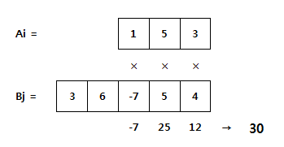

# D2

## 1954. 달팽이 숫자 (~~건들지도 못함 ㅋ~~)

pass


## 1959. 두 개의 숫자열

N 개의 숫자로 구성된 숫자열 Ai (i=1~N) 와 M 개의 숫자로 구성된 숫자열 Bj (j=1~M) 가 있다.

아래는 N =3 인 Ai 와 M = 5 인 Bj 의 예이다.


Ai 나 Bj 를 자유롭게 움직여서 숫자들이 서로 마주보는 위치를 변경할 수 있다.

단, 더 긴 쪽의 양끝을 벗어나서는 안 된다.


서로 마주보는 숫자들을 곱한 뒤 모두 더할 때 최댓값을 구하라.

위 예제의 정답은 아래와 같이 30 이 된다.




**[제약 사항]**

N 과 M은 3 이상 20 이하이다.

**[입력]**

가장 첫 줄에는 테스트 케이스의 개수 T가 주어지고, 그 아래로 각 테스트 케이스가 주어진다.

각 테스트 케이스의 첫 번째 줄에 N 과 M 이 주어지고,

두 번째 줄에는 Ai,

세 번째 줄에는 Bj 가 주어진다.

**[출력]**

출력의 각 줄은 '#t'로 시작하고, 공백을 한 칸 둔 다음 정답을 출력한다.

(t는 테스트 케이스의 번호를 의미하며 1부터 시작한다.)

```python
T = int(input())

i = 0
results = []

while i < T:
    NM = list(map(int, input().split()))
    
    n_list = list(map(int, input().split()))
    m_list = list(map(int, input().split()))

    cycle = abs(NM[0] - NM[1])

    if len(n_list) > len(m_list):
        shorter = len(m_list)
        short_list = m_list[:]
        long_list = n_list[:]

    else:
        shorter = len(n_list)
        short_list = n_list[:]
        long_list = m_list[:]


    total_temp = 0
    for k in range(cycle+1):

        temp = 0
        total = 0
        for j in range(shorter):
            temp = short_list[j] * long_list[j+k]
            total += temp

        if total_temp < total:
            total_temp = total

    results.append(total_temp)
    i += 1

for idx, result in enumerate(results):
    print(f'#{idx+1} {result}')
```

```
# input
10
3 5
1 5 3
3 6 -7 5 4
7 6
6 0 5 5 -1 1 6
-4 1 8 7 -9 3
...

# output
#1 30
#2 63
...
```


## 1961. 숫자 배열 회전

N x N 행렬이 주어질 때,

시계 방향으로 90도, 180도, 270도 회전한 모양을 출력하라.


**[제약 사항]**

N은 3 이상 7 이하이다.

**[입력]**

가장 첫 줄에는 테스트 케이스의 개수 T가 주어지고, 그 아래로 각 테스트 케이스가 주어진다.

각 테스트 케이스의 첫 번째 줄에 N이 주어지고,

다음 N 줄에는 N x N 행렬이 주어진다.

**[출력]**

출력의 첫 줄은 '#t'로 시작하고,

다음 N줄에 걸쳐서 90도, 180도, 270도 회전한 모양을 출력한다.

입력과는 달리 출력에서는 회전한 모양 사이에만 공백이 존재함에 유의하라.

(t는 테스트 케이스의 번호를 의미하며 1부터 시작한다.)

```python
T = int(input())

x = 0
results = []
n = []
while x < T:
    n.append(int(input()))

    array = []
    for i in range(n[x]):
        inner_list = list(map(int, input().split()))
        array.append(inner_list)    
    
    turn_90 = [[0] * n[x] for _ in range(n[x])]
    for i in range(n[x]):
        for j in range(n[x]):
            turn_90[j][n[x]-1-i] = str(array[i][j])

    turn_180 = [[0] * n[x] for _ in range(n[x])]
    for i in range(n[x]):
        for j in range(n[x]):
            turn_180[n[x]-1-i][n[x]-1-j] = str(array[i][j])

    turn_270 = [[0] * n[x] for _ in range(n[x])]
    for i in range(n[x]):
        for j in range(n[x]):
            turn_270[n[x]-1-j][i] = str(array[i][j])

    results.extend([[turn_90, turn_180, turn_270]])
    
    
    x += 1

for i in range(T):
    print(f'#{i+1}')
    for j in range(n[i]):
        for k in range(3):
            print(f'{"".join(results[i][k][j])}', end=' ')
        print()
```

```
# input
10
3
1 2 3
4 5 6
7 8 9
6
6 9 4 7 0 5
8 9 9 2 6 5
6 8 5 4 9 8
2 2 7 7 8 4
7 5 1 9 7 9
8 9 3 9 7 6
…

# output
#1
741 987 369
852 654 258
963 321 147
#2
872686 679398 558496
952899 979157 069877
317594 487722 724799
997427 894586 495713
778960 562998 998259
694855 507496 686278
…
```


## 1966. 숫자를 정렬하자

주어진 N 길이의 숫자열을 오름차순으로 정렬하여 출력하라.

**[제약 사항]**

N 은 5 이상 50 이하이다.


**[입력]**

가장 첫 줄에는 테스트 케이스의 개수 T가 주어지고, 그 아래로 각 테스트 케이스가 주어진다.

각 테스트 케이스의 첫 번째 줄에 N 이 주어지고, 다음 줄에 N 개의 숫자가 주어진다.


**[출력]**

출력의 각 줄은 '#t'로 시작하고, 공백을 한 칸 둔 다음 정답을 출력한다.

(t는 테스트 케이스의 번호를 의미하며 1부터 시작한다.)

```python
T = int(input())

x=0
result = []
while x < T:
    n = int(input())

    input_list = list(map(int, input().split()))

    result.append(sorted(input_list))
    x += 1

for idx, _list in enumerate(result):
    print(f'#{idx+1} {" ".join(map(str, _list))}')
```

```
#input
10
5
1 4 7 8 0
...

#output
#1 0 1 4 7 8
...
```


## 1970. 쉬운 거스름돈

우리나라 화폐 ‘원’은 금액이 높은 돈을 우선적으로 계산할 때 돈의 개수가 가장 최소가 된다.

S마켓에서 사용하는 돈의 종류는 다음과 같다.
50,000 원
10,000 원
5,000 원
1,000 원
500 원
100 원
50 원
10 원

S마켓에서 손님에게 거슬러 주어야 할 금액 N이 입력되면 돈의 최소 개수로 거슬러 주기 위하여 각 종류의 돈이 몇 개씩 필요한지 출력하라.


**[예제]**

N이 32850일 경우,
50,000 원 : 0개
10,000 원 : 3개
5,000 원 : 0개
1,000 원 : 2개
500 원 : 1개
100 원 : 3개
50 원 : 1개
10 원 : 0개


**[제약 사항]**

1. N은 10이상 1,000,000이하의 정수이다. (10 ≤ N ≤ 1,000,000)

2. N의 마지막 자릿수는 항상 0이다. (ex : 32850)


**[입력]**

가장 첫 줄에는 테스트 케이스의 개수 T가 주어지고, 그 아래로 각 테스트 케이스가 주어진다.

각 테스트 케이스에는 N이 주어진다.


**[출력]**

각 줄은 '#t'로 시작하고, 다음줄에 각 돈의 종류마다 필요한 개수를 빈칸을 사이에 두고 출력한다.

(t는 테스트 케이스의 번호를 의미하며 1부터 시작한다.)

```python
T = int(input())

x=0
result = []


while x < T:
    n = int(input())
    
    won = {50000: 0, 10000: 0, 5000: 0, 1000: 0, 500: 0, 100: 0, 50: 0, 10: 0}
    temp = n

    for key, value in won.items():
        won[key], temp = divmod(temp, key)

    result.append(list(won.values()))
    
    x += 1
for idx, _list in enumerate(result):
    print(f'#{idx+1}\n{" ".join(map(str, _list))}')
```

```
#input
2 
32850
160   

#output
#1
0 3 0 2 1 3 1 0
#2
0 0 0 0 0 1 1 1
```

