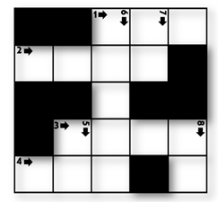
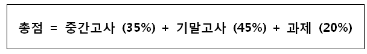

# D2

## 1979. 어디에 단어가 들어갈 수 있을까

N X N 크기의 단어 퍼즐을 만들려고 한다. 입력으로 단어 퍼즐의 모양이 주어진다.

주어진 퍼즐 모양에서 특정 길이 K를 갖는 단어가 들어갈 수 있는 자리의 수를 출력하는 프로그램을 작성하라.

**[예제]**

N = 5, K = 3 이고, 퍼즐의 모양이 아래 그림과 같이 주어졌을 때


길이가 3 인 단어가 들어갈 수 있는 자리는 2 곳(가로 1번, 가로 4번)이 된다.





**[제약 사항]**

1. N은 5 이상 15 이하의 정수이다. (5 ≤ N ≤ 15)

2. K는 2 이상 N 이하의 정수이다. (2 ≤ K ≤ N)


**[입력]**

입력은 첫 줄에 총 테스트 케이스의 개수 T가 온다.

다음 줄부터 각 테스트 케이스가 주어진다.

테스트 케이스의 첫 번째 줄에는 단어 퍼즐의 가로, 세로 길이 N 과, 단어의 길이 K 가 주어진다.

테스트 케이스의 두 번째 줄부터 퍼즐의 모양이 2차원 정보로 주어진다.

퍼즐의 각 셀 중, 흰색 부분은 1, 검은색 부분은 0 으로 주어진다.


**[출력]**

테스트 케이스 t에 대한 결과는 “#t”을 찍고, 한 칸 띄고, 정답을 출력한다.

(t는 테스트 케이스의 번호를 의미하며 1부터 시작한다.)

```python
# 가로에 가능한 단어 수를 구하는 함수
def row_crossword(cross_list, K, N):
    word_count = 0

    for row in range(N):
        letter_count = 0
        for col in range(N):
            if cross_list[row][col] == 1:
                letter_count += 1
            elif cross_list[row][col] == 0:
                if letter_count == K:
                    word_count += 1
                    letter_count = 0
                else:
                    letter_count = 0
        if letter_count == K:
            word_count += 1

    return word_count

# 세로에 가능한 단어 수를 구하는 함수
def col_crossword(cross_list, K, N):
    word_count = 0

    for row in range(N):
        letter_count = 0
        for col in range(N):
            if cross_list[col][row] == 1:
                letter_count += 1
            elif cross_list[col][row] == 0:
                if letter_count == K:
                    word_count += 1
                    letter_count = 0
                else:
                    letter_count = 0
        if letter_count == K:
            word_count += 1
        
    return word_count

T = int(input())
x = 0
while x < T:
    N, K = map(int, input().split())
    cross_list = [list(map(int, input().split())) for _ in range(N)]

    row_words_cnt = row_crossword(cross_list, K, N)
    col_words_cnt = col_crossword(cross_list, K, N)

    result = row_words_cnt + col_words_cnt

    print(f'#{x+1} {result}')

    x += 1
```

```
# input
10
5 3
0 0 1 1 1
1 1 1 1 0
0 0 1 0 0
0 1 1 1 1
1 1 1 0 1
5 3
1 0 0 1 0
1 1 0 1 1
1 0 1 1 1
0 1 1 0 1
0 1 1 1 0
…

# output
#1 2
#2 6
...
```


## 1983. 조교의 성적 매기기

학기가 끝나고, 학생들의 점수로 학점을 계산중이다.

학점은 상대평가로 주어지는데, 총 10개의 평점이 있다.


학점은 학생들이 응시한 중간/기말고사 점수 결과 및 과제 점수가 반영한다.

각각 아래 비율로 반영된다.


10 개의 평점을 총점이 높은 순서대로 부여하는데,

각각의 평점은 같은 비율로 부여할 수 있다.

예를 들어, N 명의 학생이 있을 경우 N/10 명의 학생들에게 동일한 평점을 부여할 수 있다.

입력으로 각각의 학생들의 중간, 기말, 과제 점수가 주어지고,

학점을 알고싶은 K 번째 학생의 번호가 주어졌을 때,

K 번째 학생의 학점을 출력하는 프로그램을 작성하라.


**[제약사항]**

1. N은 항상 10의 배수이며, 10이상 100이하의 정수이다. (10 ≤ N ≤ 100)

2. K는 1 이상 N 이하의 정수이다. (1 ≤ K ≤ N)

3. K 번째 학생의 총점과 다른 학생의 총점이 동일한 경우는 입력으로 주어지지 않는다.


**[입력]**

입력은 첫 줄에 총 테스트 케이스의 개수 T가 온다.

다음 줄부터 각 테스트 케이스가 주어진다.

테스트 케이스의 첫 번째 줄은 학생수 N 과, 학점을 알고싶은 학생의 번호 K 가 주어진다.

테스트 케이스 두 번째 줄 부터 각각의 학생이 받은 시험 및 과제 점수가 주어진다.


**[출력]**

테스트 케이스 t에 대한 결과는 “#t”을 찍고, 한 칸 띄고, 정답을 출력한다.

(t는 테스트 케이스의 번호를 의미하며 1부터 시작한다.)

```python
T = int(input())
x = 0
mark = ['A', 'A0', 'A-', 'B+', 'B0', 'B-', 'C+', 'C0', 'C-', 'D0']

while x < T:
    # 입력 데이터
    N, K = map(int, input().split())
    scores = [list(map(int, input().split())) for _ in range(N)]
    
    # 총점 계산
    _scores = [i[0]*0.35 + i[1]*0.45 + i[2]*0.20 for i in scores]

    # K 번째 학생 점수
    find_std = _scores[K-1]

    # 총점 내림차순 정렬
    sort_scores = sorted(_scores, reverse=True)
    
    # 학점 상대평가 범위
    sort_mark = []
    for i in mark:
        for j in range(int(N/10)):
            sort_mark.append(i)

    print(f'#{x+1} {sort_mark[sort_scores.index(find_std)]}')

    x += 1
```

```
# input
10
10 2
87 59 88
99 94 78
94 86 86
99 100 99
69 76 70
76 89 96
98 95 96
74 69 60
98 84 67
85 84 91
…

# output
#1 A-
...
```

