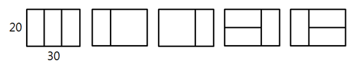

# D2

## 4869. [파이썬 S/W 문제해결 기본] 4일차 - 종이붙이기

어린이 알고리즘 교실의 선생님은 경우의 수 놀이를 위해, 그림처럼 가로x세로 길이가 10x20, 20x20인 직사각형 종이를 잔뜩 준비했다.


그리고 교실 바닥에 20xN 크기의 직사각형을 테이프로 표시하고, 이 안에 준비한 종이를 빈틈없이 붙이는 방법을 찾아보려고 한다. N이 30인 경우 다음 그림처럼 종이를 붙일 수 있다.





10의 배수인 N이 주어졌을 때, 종이를 붙이는 모든 경우를 찾으려면 테이프로 만든 표시한 영역을 몇 개나 만들어야 되는지 계산하는 프로그램을 만드시오. 직사각형 종이가 모자라는 경우는 없다.


**[입력]**

첫 줄에 테스트 케이스 개수 T가 주어진다. 1≤T≤50
다음 줄부터 테스트 케이스 별로 N이 주어진다. 10≤N≤300, N은 10의 배수


**[출력]**

각 줄마다 "#T" (T는 테스트 케이스 번호)를 출력한 뒤, 답을 출력한다.

```python
# 종이붙이기 함수
def paper(N):
    # n을 10으로 나눈 몫을 사용하므로 10 -> 1, 20 -> 2 ...로 통일

    if N == 1:      # n이 10일 경우
        return 1    # 나오는 경우의 수는 1가지

    elif N == 2:    # n 이 20일 경우
        return 3    # 나오는 경우의 수는 3가지

    # N 길이를 만들 수 있는 경우는 2가지이다
    # N-10 길이에 세로 10*20 종이를 붙이는 방법과
    # N-20 길이에 가로의 10*20 2장 혹은 20*20 1장 => origami(N-2)를 두번 곱한 이유
    # 10*20 종이를 세워 2장을 붙이는 방법은 origami(N-1)과 같음
    return paper(N - 1) + paper(N - 2) * 2

# 속도향상을 위한 DP 함수
def dp_paper(N):
    if data[N] == 0:
        data[N] = dp_paper(N - 1) + dp_paper(N - 2) * 2
    return data[N]


T = int(input())
x = 0
while x < T:
    # 총 길이 입력 (인덱스 부여를 위한 //10)
    n = int(input())//10

    # 런타임 오버 방지를 위한 DP
    data = [0 for _ in range(31)]
    data[1] = 1
    data[2] = 3

    # 종이접기 함수 호출
    res = paper(n)
    res2 = dp_paper(n)
    print('#{} {}'.format(x+1, res))
    # print('#{} {}'.format(x+1, res2))
    x += 1
```

```
# input
3
30
50
70

# output
#1 5
#2 21
#3 85
```


## 4866. [파이썬 S/W 문제해결 기본] 4일차 - 괄호검사

주어진 입력에서 괄호 {}, ()가 제대로 짝을 이뤘는지 검사하는 프로그램을 만드시오.

예를 들어 {( )}는 제대로 된 짝이지만, {( })는 제대로 된 짝이 아니다. 입력은 한 줄의 파이썬 코드일수도 있고, 괄호만 주어질 수도 있다.

정상적으로 짝을 이룬 경우 1, 그렇지 않으면 0을 출력한다.

print(‘{‘) 같은 경우는 입력으로 주어지지 않으므로 고려하지 않아도 된다.


**[입력]**

첫 줄에 테스트 케이스 개수 T가 주어진다. 1≤T≤50

다음 줄부터 테스트 케이스 별로 온전한 형태이거나 괄호만 남긴 한 줄의 코드가 주어진다.

 

**[출력]**

각 줄마다 "#T" (T는 테스트 케이스 번호)를 출력한 뒤, 답을 출력한다.

```python
def solution(text):
    for i in range(len(text)):
        if text[i] == '(' or text[i] == '{':
            s.append(text[i])

        elif text[i] == ')':
            if len(s) != 0 and s[-1] == '(':
                s.pop(-1)
            else:
                return 0

        elif text[i] == '}':
            if len(s) != 0 and s[-1] == '{':
                s.pop(-1)
            else:
                return 0
            
    if len(s) != 0:
        return 0
    else:
        return 1

T = int(input())
x = 0
while x < T:
    text = input()

    s = []
    res = solution(text)

    print('#{} {}'.format(x+1, res))
    x += 1
```

```
# input
3
print('{} {}'.format(1, 2))
N, M = map(int, input().split())
print('#{} {}'.format(tc, find())

# output
#1 1
#2 1
#3 0
```


## 4871. [파이썬 S/W 문제해결 기본] 4일차 - 그래프 경로

V개 이내의 노드를 E개의 간선으로 연결한 방향성 그래프에 대한 정보가 주어질 때, 특정한 두 개의 노드에 경로가 존재하는지 확인하는 프로그램을 만드시오.

두 개의 노드에 대해 경로가 있으면 1, 없으면 0을 출력한다.
 

예를 들어 다음과 같은 그래프에서 1에서 6으로 가는 경로를 찾는 경우, 경로가 존재하므로 1을 출력한다.
 


 

노드번호는 1번부터 존재하며, V개의 노드 중에는 간선으로 연결되지 않은 경우도 있을 수 있다.

 

**[입력]**

첫 줄에 테스트 케이스 개수 T가 주어진다. 1≤T≤50

다음 줄부터 테스트 케이스의 첫 줄에 V와 E가 주어진다. 5≤V≤50, 4≤E≤1000

테스트케이스의 둘째 줄부터 E개의 줄에 걸쳐, 출발 도착 노드로 간선 정보가 주어진다.

E개의 줄 이후에는 경로의 존재를 확인할 출발 노드 S와 도착노드 G가 주어진다.

 

**[출력]**

각 줄마다 "#T" (T는 테스트 케이스 번호)를 출력한 뒤, 답을 출력한다.

```python
T = int(input())
x = 0
while x < T:
    # 입력 데이터
    V, E = map(int, input().split())                            # 노드, 간선
    arr = [list(map(int, input().split())) for _ in range(E)]   # 간선 정보
    S, G = map(int, input().split())                            # 시작, 끝 지점

    # 인접 리스트 생성
    adj = [[] for _ in range(V+1)]
    for i in range(len(arr)):
        adj[arr[i][0]].append(arr[i][1])

    s = []                  # 스택 리스트
    visited = [0] * (V+1)   # 노드 방문 여부 리스트
    res = 0                 # 경로 존재 여부 초기화

    s.append(S)         # 시작 지점을 스택에 추가
    while len(s) != 0:  # 반복구조 dfs
        n = s.pop()     # 스택에서 갈 수 있는 노드 선택

        if n == G:      # 노드 n이 도착 지점과 동일하면
            res = 1     # 경로가 존재(1)하므로 종료
            break

        # 방문하지 않은 노드라면 밑의 로직 진행 / 방문하였다면 생략하고 pop()으로 이동
        if visited[n] == 0:
            visited[n] = 1  # 방문 했음을 표시

            if adj[n] is None:  # 방문한 노드에 간선 정보가 없다면 
                continue        # pop()으로 skip (방문만 표시되고 pop되어 사라짐)
                
            else:               # 방문한 노드에 간선 정보가 있다면 전부 스택에 추가
                for i in range(len(adj[n])):
                    s.append(adj[n][i])
    
    # 스택 길이가 0이 되어 나오면 res = 0
    # n == G로 종료되면 res = 1
    print('#{} {}'.format(x+1, res))
    x += 1
```

```
# input
3
6 5
1 4
1 3
2 3
2 5
4 6
1 6
7 4
1 6
2 3
2 6
3 5
2 5
9 9
2 6
4 7
5 7
1 5
2 9
3 9
4 8
5 3
7 8
1 9

# ouput
#1 1
#2 1
#3 1
```


## 4873. [파이썬 S/W 문제해결 기본] 4일차 - 반복문자 지우기

문자열 s에서 반복된 문자를 지우려고 한다. 지워진 부분은 다시 앞뒤를 연결하는데, 만약 연결에 의해 또 반복문자가 생기면 이부분을 다시 지운다.

반복문자를 지운 후 남은 문자열의 길이를 출력 하시오. 남은 문자열이 없으면 0을 출력한다.
 

다음은 CAAABBA에서 반복문자를 지우는 경우의 예이다.
 

C**AA**ABBA 연속 문자 AA를 지우고 C와 A를 잇는다.

CA**BB**A 연속 문자 BB를 지우고 A와 A를 잇는다.

C**AA** 연속 문자 AA를 지운다.

C 1글자가 남았으므로 1을 리턴한다.
 

**[입력]**

첫 줄에 테스트 케이스 개수 T가 주어진다. 1≤T≤ 50

다음 줄부터 테스트 케이스의 별로 길이가 1000이내인 문자열이 주어진다.

 

**[출력]**

\#과 1번부터인 테스트케이스 번호, 빈칸에 이어 답을 출력한다.

```python
T = int(input())
x = 0
while x < T:
    word = input()

    i = 0
    # 중복 단어 제거 반복
    while i < len(word)-1:                  # 2글자씩 비교하므로 len()-1
        if word[i] == word[i+1]:            # i번째와 i+1번째 글자가 같은 경우
            word = word[0:i] + word[i+2:]   # 단어 슬라이싱
            i = -1                          # i 초기화 (다음 명령으로 i=0부터 시작)
        i += 1

    print('#{} {}'.format(x+1, len(word)))
    x += 1
```

```
# input
3
ABCCB
NNNASBBSNV
UKJWHGGHNFTCRRCTWLALX

# output
#1 1
#2 4
#3 11
```

