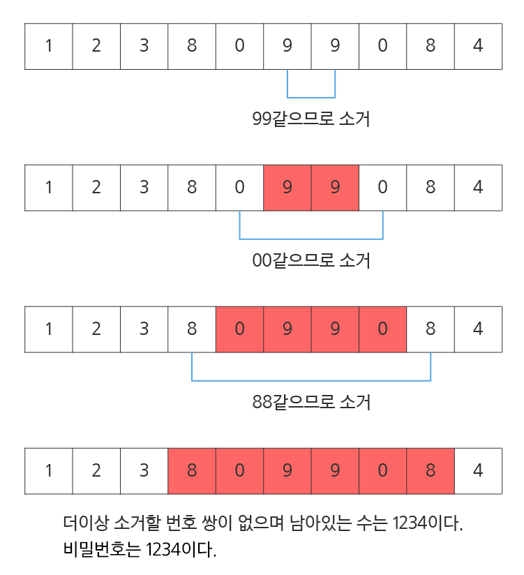

# D3

## 5356. 의석이의 세로로 말해요

아직 글을 모르는 의석이가 벽에 걸린 칠판에 자석이 붙어있는 글자들을 붙이는 장난감을 가지고 놀고 있다.

이 장난감에 있는 글자들은 영어 대문자 ‘A’부터 ‘Z’, 영어 소문자 ‘a’부터 ‘z’, 숫자 ‘0’부터 ‘9’이다. 의석이는 칠판에 글자들을 수평으로 일렬로 붙여서 단어를 만든다.

다시 그 아래쪽에 글자들을 붙여서 또 다른 단어를 만든다. 이런 식으로 다섯 개의 단어를 만든다. 아래에 의석이가 칠판에 붙여 만든 단어들의 예가 있다.


A A B C D D

a f z z

0 9 1 2 1

a 8 E W g 6

P 5 h 3 k x

 

만들어진 다섯 개의 단어들의 글자 개수는 서로 다를 수 있다.


심심해진 의석이는 칠판에 만들어진 다섯 개의 단어를 세로로 읽으려 한다.

세로로 읽을 때, 각 단어의 첫 번째 글자들을 위에서 아래로 세로로 읽는다. 다음에 두 번째 글자들을 세로로 읽는다.

이런 식으로 왼쪽에서 오른쪽으로 한 자리씩 이동 하면서 동일한 자리의 글자들을 세로로 읽어 나간다.

위의 그림 1의 다섯 번째 자리를 보면 두 번째 줄의 다섯 번째 자리의 글자는 없다. 이런 경우처럼 세로로 읽을 때 해당 자리의 글자가 없으면, 읽지 않고 그 다음 글자를 계속 읽는다.

그림 1의 다섯 번째 자리를 세로로 읽으면 D1gk로 읽는다.

위에서 의석이가 세로로 읽은 순서대로 글자들을 공백 없이 출력하면 다음과 같다:

 

Aa0aPAf985Bz1EhCz2W3D1gkD6x


칠판에 붙여진 단어들이 주어질 때, 의석이가 세로로 읽은 순서대로 글자들을 출력하는 프로그램을 작성하라.

 

**[입력]**

첫 번째 줄에 테스트 케이스의 수 T가 주어진다.

각 테스트 케이스는 총 다섯 줄로 이루어져 있다.

각 줄에는 길이가 1이상 15이하인 문자열이 주어진다. 각 문자열은 영어 대문자 ‘A’부터 ‘Z’, 영어 소문자 ‘a’부터 ‘z’, 숫자 ‘0’부터 ‘9’만으로 이루어져 있다.


**[출력]**

각 테스트 케이스마다 #T를 출력하고 한 칸을 띄운 후, 의석이가 세로로 읽은 순서대로 글자들을 출력한다.

```python
T = int(input())

x = 0
while x < T:
    text = [input() for _ in range(5)]
    
    # 텍스트 리스트 내에 가장 긴 단어
    max_len = 0
    for i in range(5):
        if max_len < len(text[i]):
            max_len = len(text[i])
            
    # 열 우선 순회
    print('#{}'.format(x+1), end=' ')
    for i in range(max_len):
        for j in range(5):
            # 만일 text[j] 번째 단어의 길이가 i 인덱스보다 짧을 경우 넘어감
            if len(text[j]) <= i:
                continue
            else:
                print(text[j][i], end='')
    print()

    x += 1
```

```
# input

2
ABCDE    //Test Case #1의 시작
abcde
01234
FGHIJ
fghij
AABCDD    //Test Case #2의 시작
afzz
09121
a8EWg6
P5h3kx

# output
#1 Aa0FfBb1GgCc2HhDd3IiEe4Jj
#2 Aa0aPAf985Bz1EhCz2W3D1gkD6x
```


## [S/W 문제해결 기본] 10일차 - 비밀번호

평소에 잔머리가 발달하고 게으른 철수는 비밀번호를 기억하는 것이 너무 귀찮았습니다.

적어서 가지고 다니고 싶지만 누가 볼까봐 걱정입니다. 한가지 생각을 해냅니다.
 
0~9로 이루어진 번호 문자열에서 같은 번호로 붙어있는 쌍들을 소거하고 남은 번호를 비밀번호로 만드는 것입니다.

번호 쌍이 소거되고 소거된 번호 쌍의 좌우 번호가 같은 번호이면 또 소거 할 수 있습니다.

예를 들어 아래의 번호 열을 철수의 방법으로 소거하고 알아낸 비밀 번호입니다.
 




**[입력]**

10개의 테스트 케이스가 10줄에 걸쳐, 한 줄에 테스트 케이스 하나씩 제공된다.

각 테스트 케이스는 우선 문자열이 포함하는 문자의 총 수가 주어지고, 공백을 둔 다음 번호 문자열이 공백 없이 제공된다.

문자열은 0~9로 구성되며 문자열의 길이 N은 10≤N≤100이다. 비밀번호의 길이는 문자열의 길이보다 작다.
 
**[출력]**

\#부호와 함께 테스트 케이스의 번호를 출력하고, 공백 문자 후 테스트 케이스에 대한 답(비밀번호)을 출력한다.

```python
x = 0
while x < 10:
    pw_len, pw = map(str, input().split())

    s = []
    for i in range(int(pw_len)):
        s.append(pw[i])
        if len(s) >= 2 and s[-1] == s[-2]:
            s = s[:-2]

    print('#{} {}'.format(x+1, ''.join(s)))
    x += 1
```

```
# input
10 1238099084  
16 4100112380990844
...

# output
#1 1234
#2 4123
...
```

